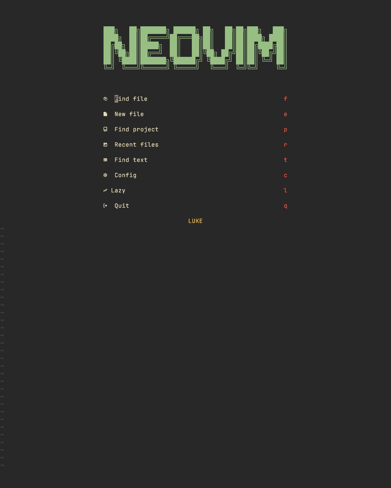
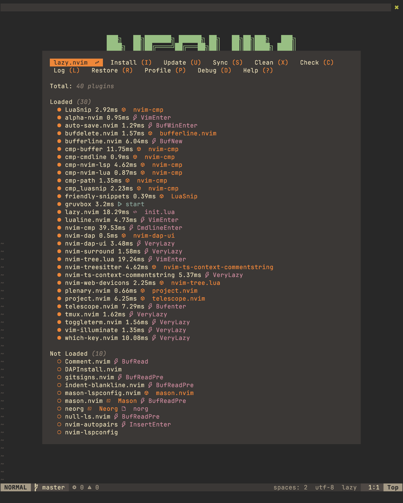
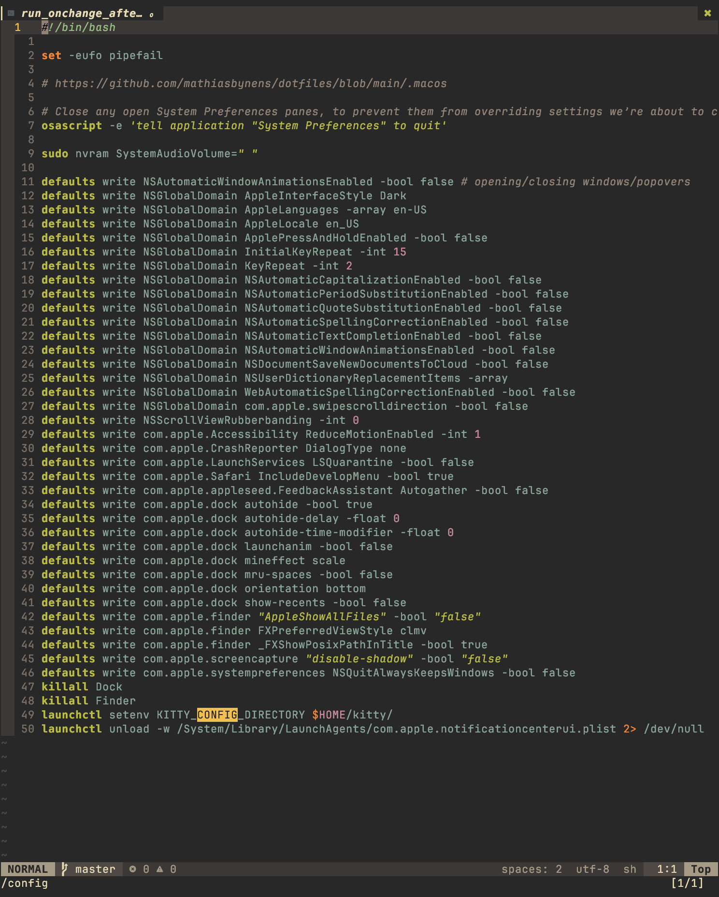
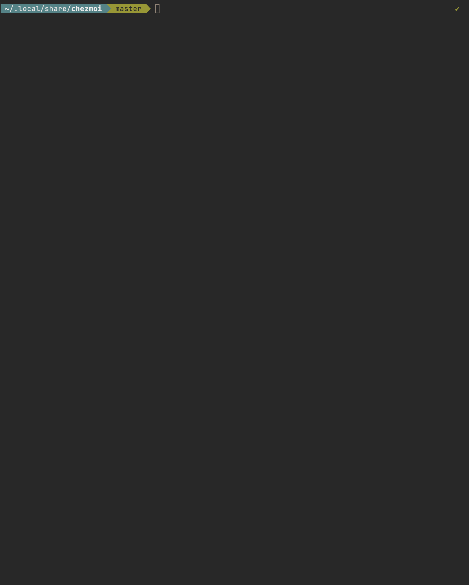
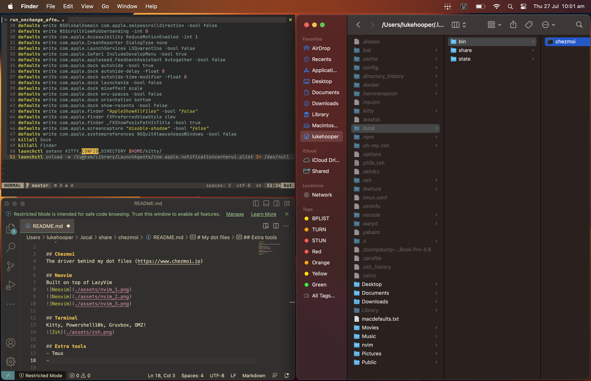

# My dot files

## Chezmoi
The driver behind my dot files (https://www.chezmoi.io)

## Neovim
Built on top of LazyVim

## Terminal
Kitty, Powershell10k, Gruvbox, OMZ!

# Window Tiling Manager
Yabai and skhd

## Extra tools
- Tmux
- Hammerspoon?
- Warpd?
- Thefuck
